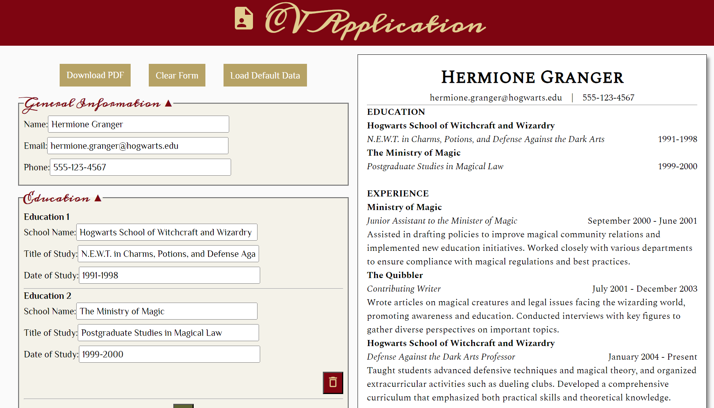
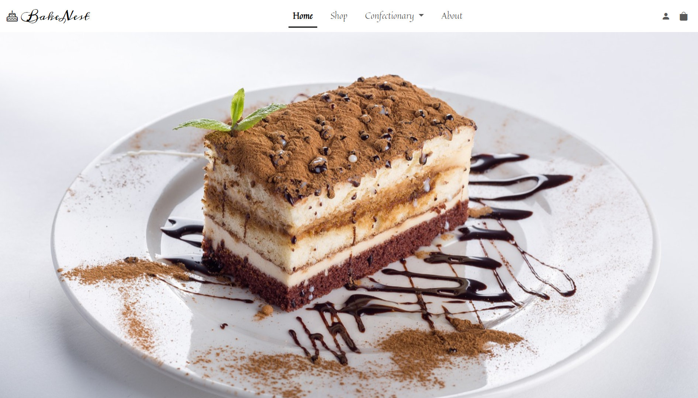
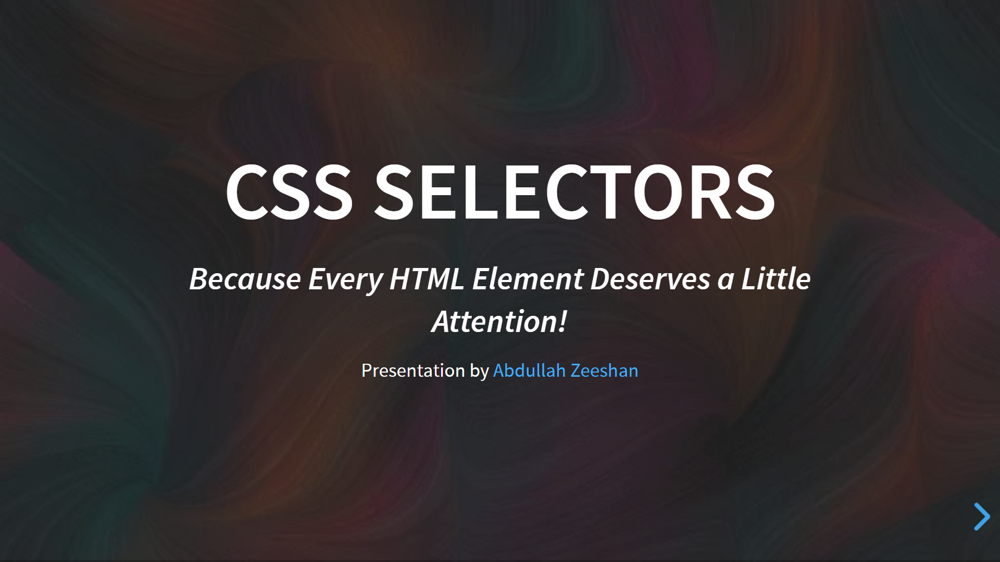
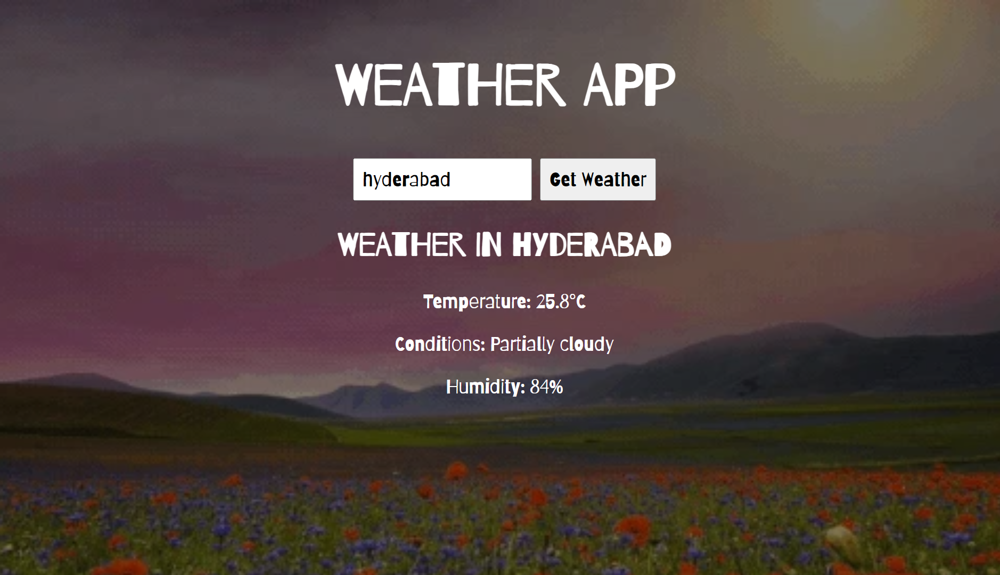
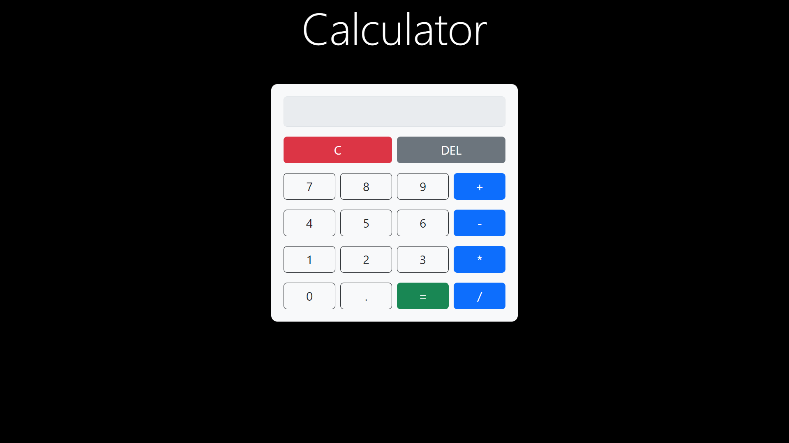
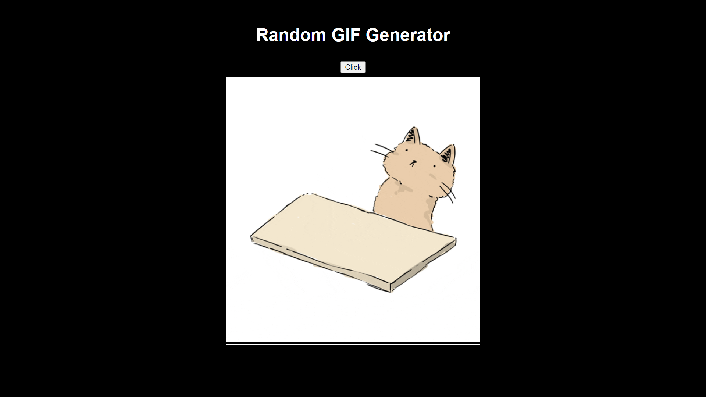

# README

  

## About

This repo was created as part of the 3-month Frontend Development apprenticeship program at [Meta Scifor Technologies](https://metascifor.com/) from the duration of August 2024 until October 2024.

It acted as my working repo during the apprenticeship period.

## Highlighted Works

### Major Project: CV Application

- [Live Site](https://cv-application-plum-chi.vercel.app/)
- [Repo](https://github.com/Zeeshan777/GITHUB-ABDULLAHZEESHAN_SCIFOR/tree/main/major-project/)

### Mini-Project 1: BakeNest

- [Live Site](https://zeeshan777.github.io/GITHUB-ABDULLAHZEESHAN_SCIFOR/mini-projects/mini-project-01/bakenest/)
- [Repo](https://github.com/Zeeshan777/GITHUB-ABDULLAHZEESHAN_SCIFOR/tree/main/mini-projects/mini-project-01/bakenest)

### Mini Project 2: Portfolio Site

- [Live Site](https://zeeshan777.github.io/GITHUB-ABDULLAHZEESHAN_SCIFOR/mini-projects/mini-project-02/portfolio/)
- [Repo](https://github.com/Zeeshan777/GITHUB-ABDULLAHZEESHAN_SCIFOR/tree/main/mini-projects/mini-project-02/portfolio)

### CSS Selectors Presentation

- [Live Site](https://zeeshan777.github.io/GITHUB-ABDULLAHZEESHAN_SCIFOR/presentation/css-selectors/)
- [Repo](https://github.com/Zeeshan777/GITHUB-ABDULLAHZEESHAN_SCIFOR/tree/main/presentation/css-selectors)

### Weather App

- [Live Site](https://zeeshan777.github.io/GITHUB-ABDULLAHZEESHAN_SCIFOR/tests/test-13/)
- [Repo](https://github.com/Zeeshan777/GITHUB-ABDULLAHZEESHAN_SCIFOR/tree/main/tests/test-13)

### Calculator

- [Live Site](https://zeeshan777.github.io/GITHUB-ABDULLAHZEESHAN_SCIFOR/daily-tasks/2024-09-17/calculator/index.html)
- [Repo](https://github.com/Zeeshan777/GITHUB-ABDULLAHZEESHAN_SCIFOR/tree/main/daily-tasks/2024-09-17/calculator)

### Random GIF Generator

- [Live Site](https://zeeshan777.github.io/GITHUB-ABDULLAHZEESHAN_SCIFOR/daily-tasks/2024-09-19/giphy/)
- [Repo](https://github.com/Zeeshan777/GITHUB-ABDULLAHZEESHAN_SCIFOR/tree/main/daily-tasks/2024-09-19/giphy)

## Learning Outcomes

### Technologies

The following technologies were taught during the apprenticeship:

- HTML
- CSS
- JavaScript
- Bootstrap
- Foundations Framework
- React
 
## Acknowledgments

- Special thanks to **Lekha Savale Maam** for being my mentor during the apprenticeship program.
- A heartful thank you to my fellow mates **Sarbajit**, **Ashwin**, and **Pratyusha** for supporting me throughout the program.

## Contact

For any questions or feedback, feel free to reach out to me via <aabdullahzeeshan77@gmail.com>.

